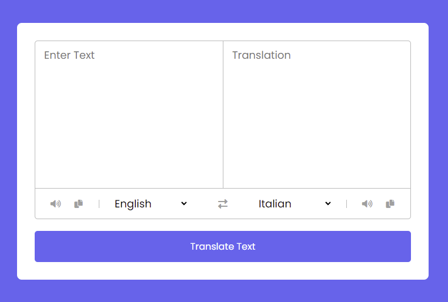
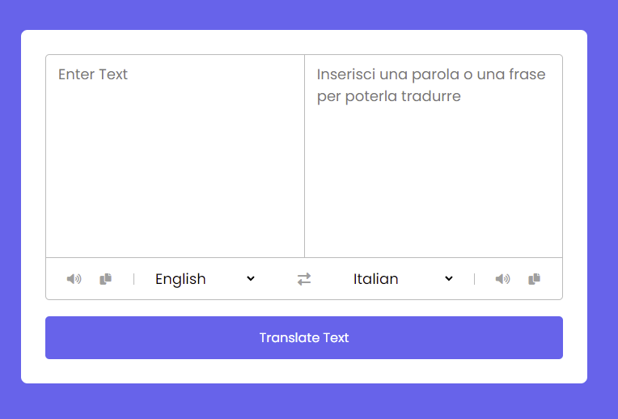
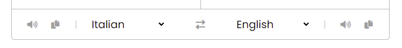
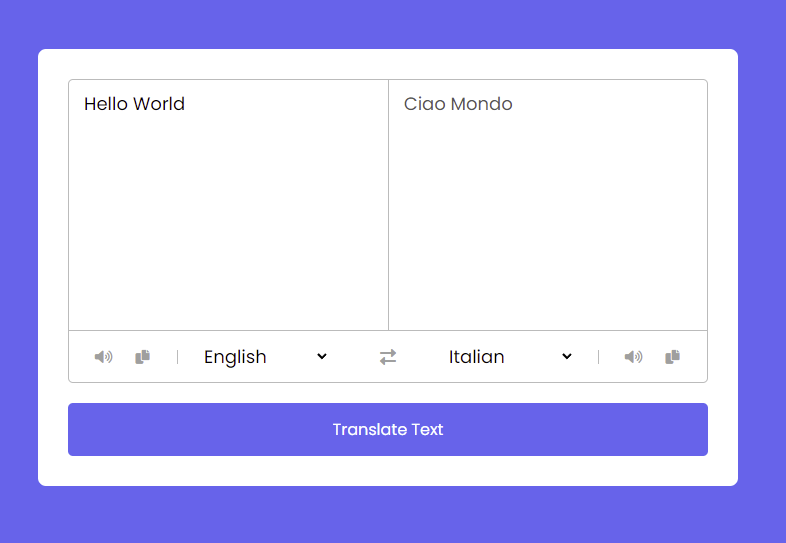

# Progetto Javascript translator app

Progetto di medio-semplice complessità, in full JS plain, che grazie all'aiuto di un'API permette la traduzione vocale e, quasi istantanea, di una frase digitata dall'utente nell'apposito input. Ho utilizzato :

- HTML
- CSS
- JAVASCRIPT

API Gratuita a questo link : **https://mymemory.translated.net/doc/spec.php**

Condizione iniziale dell'APP

Al click input vuoto non viene lanciata la chiamata API e rilascia un placeholder che incita l'utente a scriverea qualcosa

Utilizzo di icone, tramite fontAwesome per :

- Copia dell'area di testo (Sia utente che lato risposta)
- Icona vocale che utilizza funzione JS SpeechSynthesisUtterance()
- Select con diversi option, tutti generati dinamicamente tramite ciclo for/forEach preso da oggetto creato in `countries.js`

Risultato della traduzione da inglese a italiano

